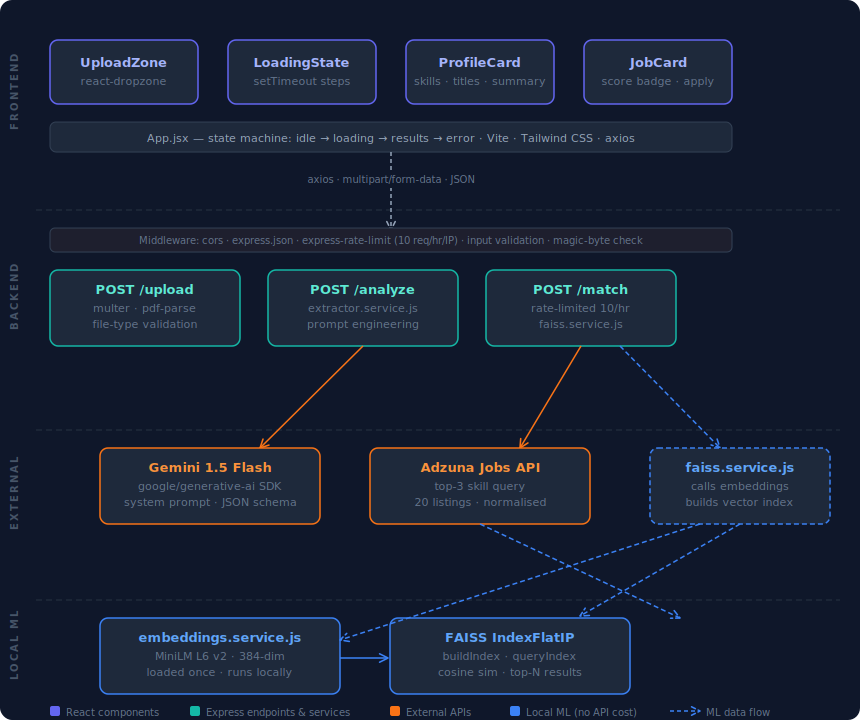
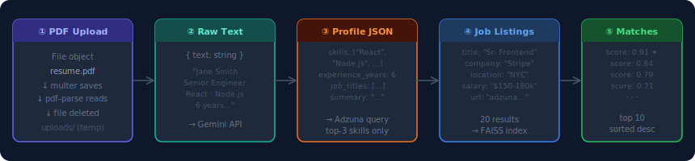
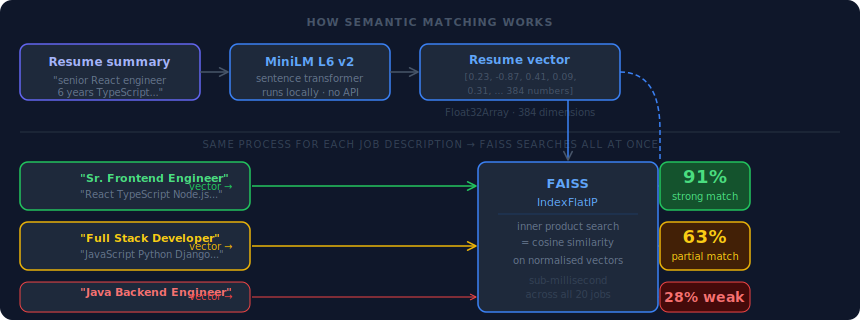

# ResumeRAG

> AI-powered resume-to-job matching — upload a PDF and get ranked job listings based on semantic similarity, not keyword overlap.

---

## What it does

Drop in a resume. The app extracts your skills and experience using Gemini, fetches real job listings from Adzuna, converts everything into vector embeddings locally using a sentence transformer, and ranks jobs by cosine similarity against your resume summary using FAISS. The result is a sorted list of roles with a match score from 0–100%.

No keyword stuffing. No manual filters. Just semantic closeness between what you do and what the role needs.

> **Live demo:** *(add your Vercel URL here)*

---

## System design



---

## How the data flows



Each stage transforms the data into something more structured. The PDF becomes raw text, raw text becomes a typed profile JSON, the profile's top 3 skills query Adzuna for 20 real listings, and FAISS ranks them by vector similarity against the resume summary.

---

## How the matching works



Most job platforms match on keywords. If your resume says "React" and the job says "ReactJS" it might miss entirely. ResumeRAG uses semantic similarity instead:

1. The resume summary and each job description are converted into 384-dimensional vectors using MiniLM L6 v2, a sentence transformer that runs fully locally
2. Each vector is a point in 384-dimensional space — proximity means semantic similarity, not shared vocabulary
3. FAISS finds the job vectors nearest to the resume vector using inner product search (equivalent to cosine similarity on normalised vectors)
4. Results come back sorted by score — 0.91 means the job and resume are semantically very close regardless of exact wording

This is why "frontend engineer with TypeScript experience" matches a "React developer role" even with zero shared words.

---

## Tech stack

| Layer | Technology | Why |
|---|---|---|
| Frontend | React + Vite | Vite's ES module dev server starts instantly — no bundling delay on every save |
| Styling | Tailwind CSS | Utility classes keep styles co-located with components; no context-switching to separate files |
| File upload | react-dropzone | Handles drag-and-drop, MIME filtering, and hidden input wiring in one clean hook |
| HTTP client | axios | Consistent error shape across 4xx/5xx; cleaner multipart/form-data handling than native fetch |
| Backend | Node.js + Express | Minimal overhead for an API server; async I/O handles parallel service calls cleanly |
| PDF parsing | pdf-parse + file-type | pdf-parse extracts text; file-type reads magic bytes to verify the file is actually a PDF |
| AI extraction | Gemini 1.5 Flash | Best structured JSON extraction from unstructured text given a tight system prompt + schema |
| Job listings | Adzuna API | Free tier with real listings; skill-based query returns relevant results without manual filters |
| Embeddings | @xenova/transformers · MiniLM L6 v2 | Sentence transformer runs fully locally — zero embedding API cost, zero network latency |
| Vector search | faiss-node · IndexFlatIP | Exact nearest-neighbor search with optimised BLAS ops; right-sized for hundreds of job vectors |
| Rate limiting | express-rate-limit | Protects Gemini + Adzuna quotas — 10 requests/hour per IP on the match endpoint |
| Deployment | Render + Vercel | Zero-config deploys from GitHub; free tiers cover portfolio-scale traffic |

---

## Setup

Prerequisites: Node.js 18+, a [Gemini API key](https://aistudio.google.com), an [Adzuna API key](https://developer.adzuna.com)

```bash
# 1. Clone and start the backend
git clone https://github.com/yourusername/resumerag-backend
cd resumerag-backend && npm install
cp .env.example .env        # fill in your API keys
npm run dev                 # → http://localhost:3000

# 2. Clone and start the frontend (new terminal)
git clone https://github.com/yourusername/resumerag-frontend
cd resumerag-frontend && npm install
npm run dev                 # → http://localhost:5173
```

Open `http://localhost:5173` and drop in a PDF resume.

---

## Environment variables

**Backend — `.env`**
```
GEMINI_API_KEY=
ADZUNA_APP_ID=
ADZUNA_APP_KEY=
ADZUNA_BASE_URL=https://api.adzuna.com/v1/api/jobs
ADZUNA_COUNTRY=us
PORT=3000
```

**Frontend — `.env.development`**
```
VITE_API_URL=http://localhost:3000
```

**Frontend — `.env.production`**
```
VITE_API_URL=https://your-backend.onrender.com
```

---

## API reference

| Method | Endpoint | Body | Returns |
|---|---|---|---|
| `GET` | `/health` | — | `{ status: "ok", timestamp }` |
| `POST` | `/api/resume/upload` | `multipart/form-data` · field: `resume` | `{ text: string }` |
| `POST` | `/api/resume/analyze` | `{ resumeText: string }` | `{ skills[], experience_years, job_titles[], summary }` |
| `POST` | `/api/resume/match` | `{ resumeText: string }` | `{ profile, matches[] }` |
| `POST` | `/api/jobs/search` | `{ skills: string[] }` | `{ jobs[] }` |

Rate limit: 10 requests / hour / IP on `/api/resume/match`.

All error responses:
```json
{ "success": false, "error": "human-readable message" }
```

---

## Project structure

```
resumerag-backend/
├── src/
│   ├── routes/
│   │   ├── resume.routes.js        upload · analyze · match
│   │   └── jobs.routes.js          job search
│   ├── controllers/
│   │   ├── resume.controller.js    request parsing + response shaping
│   │   └── jobs.controller.js
│   ├── services/
│   │   ├── parser.service.js       PDF → raw text (pdf-parse + magic byte check)
│   │   ├── extractor.service.js    raw text → structured profile (Gemini)
│   │   ├── jobs.service.js         skills → job listings (Adzuna + normalizer)
│   │   ├── embeddings.service.js   text → Float32Array[384] (MiniLM, loaded once)
│   │   └── faiss.service.js        buildIndex · queryIndex
│   ├── middleware/
│   │   └── rateLimiter.js
│   └── app.js                      Express setup + model warm-up at startup
├── uploads/                        temp only — files deleted after extraction
└── .env.example

resumerag-frontend/
├── src/
│   ├── components/
│   │   ├── UploadZone.jsx          drag-and-drop, MIME validation
│   │   ├── LoadingState.jsx        multi-step progress (setTimeout chain)
│   │   ├── ProfileCard.jsx         skills tags, experience, titles, summary
│   │   └── JobCard.jsx             job result + colour-coded similarity badge
│   └── App.jsx                     state machine + all API calls (axios)
├── .env.development
└── .env.production

docs/
├── system-design.svg               four-layer architecture diagram
├── data-pipeline.svg               data shape at each pipeline stage
└── matching-algorithm.svg          how FAISS semantic matching works
```

---

## Challenges & learnings

**The hardest bug was CORS** — and the frustrating part was that the server was working perfectly the whole time. Every request from the React frontend came back blocked, the network tab showed no response body, and the error message pointed at the browser rather than the code. The fix was two lines in Express (`app.use(cors())` and `app.set('trust proxy', 1)` for Render's reverse proxy), but getting there meant properly understanding what CORS actually is: a browser-enforced policy, not a server error. Postman worked fine throughout because Postman doesn't implement the same-origin policy. Once that distinction clicked — the server was never the problem, the browser was gatekeeping on the server's behalf — the fix was obvious. The lesson: always test with `curl` alongside Postman so you can isolate whether a failure is HTTP-level or browser-level.

**Multipart/form-data took longer than expected to reason about.** Coming from a frontend background, sending data meant `JSON.stringify` and a `Content-Type: application/json` header. File uploads are different — the browser encodes the request body as multiple named parts, one of which is raw binary, and `express.json()` has no idea how to parse any of it. Understanding why multer exists (and what it's actually doing — intercepting the stream, writing the file to disk, and populating `req.file` before the controller runs) made the middleware chain make sense. The order of middleware matters: multer has to run before the controller function, or `req.file` is undefined and the error is completely silent.

**The architectural call I'd revisit is the FAISS index lifecycle.** Right now every call to `/api/resume/match` builds a brand new FAISS index from scratch — generate embeddings for all 20 job descriptions, allocate the index, add the vectors, then immediately throw it away after querying. For a single user this is fine. But the embedding model is already loaded once at startup for exactly this reason, and the same logic should apply to the index: if two users search for "React Node.js" within minutes of each other, there's no reason to re-embed the same 20 Adzuna results twice. The fix is caching the index keyed on a hash of the skill query with a TTL that matches how often Adzuna results change. That's a Redis problem, and it's the first thing I'd add in a second pass.

---

## What I'd build next

- **Redis caching** — same skill query from two users should not hit Adzuna twice; cache results by skill fingerprint with a 1-hour TTL
- **Persistent embeddings** — FAISS index rebuilds from scratch on every request; pgvector or Pinecone would store embeddings across requests
- **Recruiter mode** — upload 100 resumes, rank them against one job description (flip the query direction entirely)
- **Resume versioning** — let users save multiple resumes and compare match scores across different role types
- **Streaming responses** — stream Gemini output token-by-token to the frontend instead of waiting for the full JSON

---

## License

MIT
